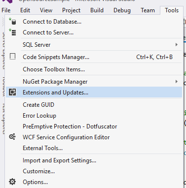
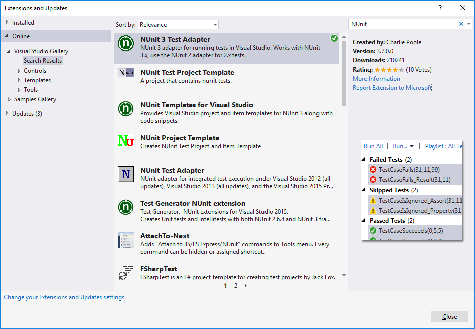

#  Installation

## Requirements
Visual Studio Professional (or Enterprise) 2015 or above.
MSDN subscription

## Install Using Visual Studio
1. Open Visual Studio and open "Extensions and Updates"  

### (screenshot here )

2. Find and download MAQS  

### (screenshot here )

## Install Using The VS Marketplace
The MAQS Visual Studio Extension contains a collection of templates for NUnit, VSTest, Test Classes, and Page Models.
It can be downloaded from the [Microsoft Marketplace](https://marketplace.visualstudio.com/items?itemName=vs-publisher-1465771.MAQSOpenFramework)

## Install Using the NuGet Package
In the package manage console write:

### (screenshot here)

```
PM Installer
```
Or install with the NuGet package manager:

### (screenshot here)

```
NuGet
```

## Adding NUnit Extension
Templates for NUnit tests are included with MAQS, but the NUnit 3 Test Adapter extension is required to be installed before NUnit tests can be run.

1. Open Extensions and Updates under Tools in the toolbar.  
  

2. Search NUnit in Online  
  
3. Download NUnit 3 Test Adapter

## Building Your First Project
After the MAQS Visual Studio Extension and NuGet package have been installed, you're ready to start testing.

1. Go To File > New > Project
2. Under Templates (in the side panel)
3. Magenic's Open Test

There are two options, MAQS Framework - Selenium , that will start a project with tests run in VSTest, or MAQS Framework - NUnit - Selenium.  The only difference is the test adapter used with the included test templates.

Finally name the solution whatever you'd like to name, and click "ok".

For next steps, check our [Getting Started guide](Getting-Started.md).