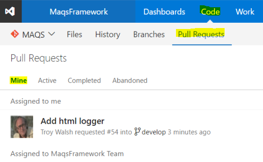
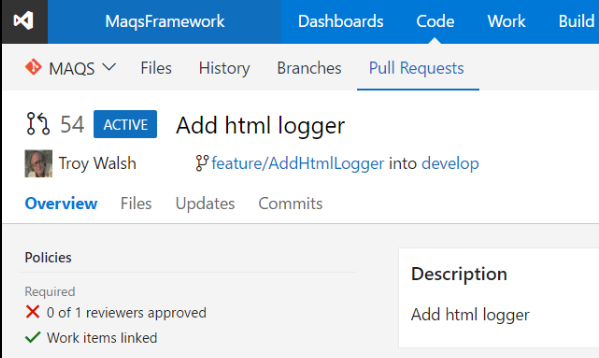
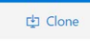
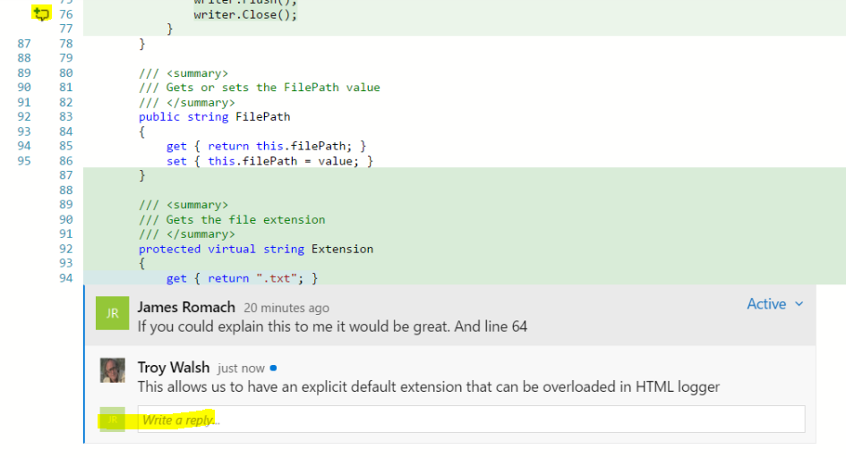
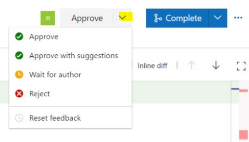

# Code Review
1. Find reviews assigned to you  
   
2. Open the code review  
   
3. Pull down the feature branch code locally  
   
4. Review code changes  
   
5. Add review comments and questions  
  
5. Finish the review  
  