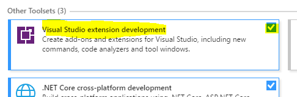
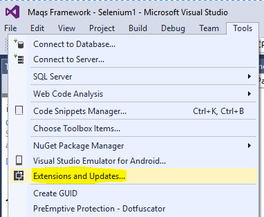
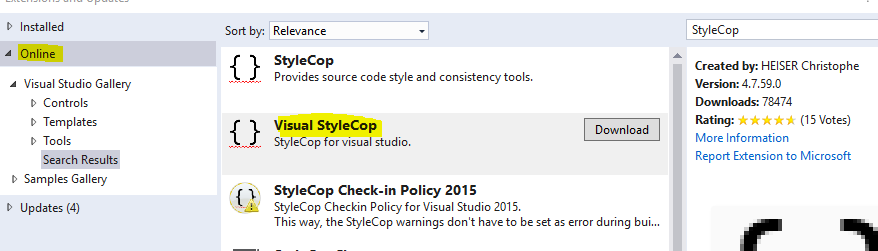
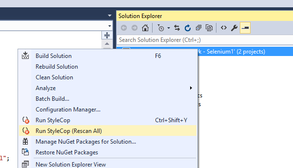

# Basic Setup
1. Install Visual Studio 2012 or above.  
*You will need the **Professional** version or above - **Test Professional will not work***  
*In order to do extension development you will need Visual Studio 2017 with the extension development feature  
  

2. Intall required Visual Studio extensions  
[NUnit3 Test Adapter](https://marketplace.visualstudio.com/items?itemName=NUnitDevelopers.NUnit3TestAdapter)  
[Visual StyleCop](https://marketplace.visualstudio.com/items?itemName=ChristopheHEISER.VisualStyleCop)  

# Notes
## Installing an extension from Visual Studio
1. Open Visual Studio  
2. Got the the extensions and updates menu  
  
3. Find and install your extension  
  
4. Restart Visual Studio  
5. Use the installed tool  
    

## Other tools
You are free to use style and formatting tools if they **don't adversely** affect the project or change history.
### When not to use other tools
1. They violate or StyleCop settings
2. The automatically refactor code - This messes with the history and makes diffing code a nightmare
