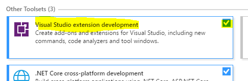

# Basic Setup
1. Install Visual Studio 2012 or above.  
*You will need the Professional version or above - **Test Professional will not work*** 
*In order to do extension development you will need Visual Studio 2017 with the extension development feature
  

2. Intall required Visual Studio extensions
[NUnit3 Test Adapter](https://marketplace.visualstudio.com/items?itemName=NUnitDevelopers.NUnit3TestAdapter)
[Visual StyleCop](https://marketplace.visualstudio.com/items?itemName=ChristopheHEISER.VisualStyleCop)

Notes
## Installing an extension from Visual Studio
1. Open Visual Studio
2. Got the the extensions and updates menu
  
3. Find and install your extension
  
  

