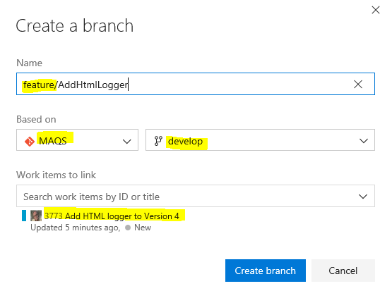
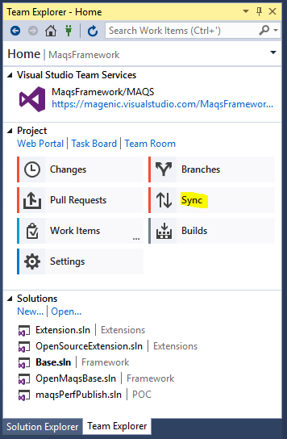

Contents:
[Development](#Development)
[Code Review](#Code Review)
[Testing](#Testing)
[Builds](#Builds)

# Development
1. Find your work in VSTS  

2. In the work item (PBI) click the create a new branch link  
  
3. Create the branch  
	Make sure you are branch starts with feature/  
	Make sure you are branching from MAQS develop 
	Make sure your work item is linked  
  
4. Go team explored home  
  
5. Go to Visual Studio and sync  
  

6. Find your branch  
  

7. Note - Visual Studio is now using your new branch  

8. Go team explored home  

9. Open the solution you need to work on  
10. Commit your changes  
    
  
 * Commit All only commits to your local version of the repository
 * Commit All and Push commits to your local version of the repository and the centralized repository
 * Commit All and Sync commits to your local version of the repository and the centralized repository.  It then pulls changes down from the centralized repository  
11. Create a pull request  
    
12. Optional - Mark the pull request as auto complete and email your code reviewers  
    
    

# Code Review
1. Find reviews assigned to you  
   
2. Open the code review  
   
3. Pull down the feature branch code locally  
   
4. Review code changes  
   
5. Add review comments and questions  
  
5. Finish the review  
  

# Testing
## CI
Each time we try to  merge into development a build is automatically kicked off.
If the solution fails to build or any of the tests fail we block the merge.
## Release
Before each release we manually run the [MAQS test suite](https://magenic.visualstudio.com/MaqsFramework/_testManagement?planId=2159&suiteId=2160&_a=tests)

# Builds
1. [Pull request](https://magenic.visualstudio.com/MaqsFramework/_build/index?context=Mine&path=%5C&definitionId=51&_a=completed) build  
 * Run with every pull request - failure will prevent code from being checked in
2. [Nuget And Extension](https://magenic.visualstudio.com/MaqsFramework/_build/index?context=Mine&path=%5C&definitionId=54&_a=completed) build  
 * Run on demand - Creates  a build version specific package and extension for internal testing purposes (Full version)
3. [Open Nuget And Extension](https://magenic.visualstudio.com/MaqsFramework/_build/index?context=Mine&path=%5C&definitionId=55&_a=completed) build  
 * Run on demand - Creates a build version specific package and extension for internal testing purposes (Open source version)
4. [Nuget And Extension - Internal Release](https://magenic.visualstudio.com/MaqsFramework/_build/index?context=Mine&path=%5C&definitionId=56&_a=completed) build  
 * Run on demand - Creates a release build version (Open source and full version) 