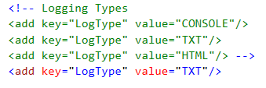
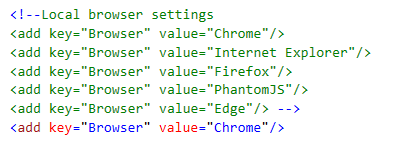

#  Configurations

## Introduction
This document will cover the configurations that can be made to MAQS (Magenic Automation Quick-Start) tests.

## Application Configuration
The MAQS project solutions make use of a collection of configurations tied to the MAQS base solution.  These configurations are stored in an XML document called the app.config.
The app.config file includes configurations for each project solution, as well as generic configurations for handling MAQS specific functions.
### General Test Configurations
There are general test configurations included in every project template. They control wait time, time-out, and log levels.
#### Wait Time & Timeout
The generic wait methods included with MAQS are methods that contain a loop where the called method will try to wait for certain conditions to be met, and if the conditions aren’t met, the method will wait the set wait time and check again if the conditions are met.
Once the method has waited after a set amount of time, it will timeout and throw an exception. This timeout is also set in the app.config.
The WaitTime and Timeout configurations can be modified to allow for longer or shorter wait times and/or have the test wait longer or shorter on certain conditions.  

#### Log Configuration
MAQS contains configurations for a test log in the app.config file. Options to adjust when a log is created for a test, the level of specificity, and the format of the log are included in every project.
##### Logging Format
The option to enable the log is located in the app.config. The options available are to create a log with the file format as plain text (.txt), Hypertext Markup Language(.html), or to output the log to the Visual Studio console.  

##### Log Conditions  
The option to set the conditions in which a log is created is set in the app.config.  
  

With the default option "Yes," a test will always create a corresponding log after the test finishes. The other options are “No” and “OnFail.” “No” will never create a log under any circumstance, while “OnFail” will only create a log if the test fails.
##### Log Output Location
  
A log file path can be defined to a specific folder or shared folder that the test runner has access to.  Simply set the value for the key “FileLoggerPath” to be the preferred location. 

##### Log Level
  
Each log level is grouped into a hierarchy, with the highest log levels also including any messages from lower log levels in the hierarchy.
Verbose mode includes all information gathered by the logger, which includes any navigation that occurs on the page, and anytime the WebDriver attempts to find an element or interact with an element. Verbose mode will result in many, often superfluous, lines of information.
Information mode includes messages for when a WebDriver is loaded, a value is identified, an element is interacted with, or whenever the WebDriver throws an exception.
Generic mode is the default logging level. It includes performance timers, and log interactions such as when a performance timer log is saved.
Success mode will output a message anytime a soft assert is successful, or as a test ends and the test is successful.
Warning mode will output a message anytime a soft assert fails, the test is met with unexpected results, or the test configuration fails to update.
Error mode will only display messages that would fail a test. This includes a test failed, a test resulted in being inconclusive, a setup failed, or the final soft assert data contains any failed soft asserts.
Suspended mode will result in no information written to the log. 

### Selenium Test Configuration
Selenium specific configurations assist in switching between web browsers, setting up remote browser settings, selecting a specific WebDriver, or setting base root information.
#### Local Browser Settings 
 
A browser key is included in the app.config to define which web browser will be used for tests. To switch between browsers simply change the value of the key “Browser” to the intended browser.
The WebDriver will go off the path to the browser on the machine the test is being run on.
The web browser needs to be installed for tests to be run against that browser.
#### WebDriver Hint Path
  
The WebDriver used by the tests can be overridden to point towards a different web driver and/or a specific version of a web driver, such as ChromeDriver, FirefoxDriver, etc. This is useful for compatibility tests to compare tests between browser versions.
#### Remote Browser Settings
 
The app.config file can be configured to send tests to a hub for distribution. The “Browser” key needs to have a value set to “Remote.” The “RemoteBrowser” key needs to be set to the web browser that the tests will be run against. Finally, it needs the key “HubUrl” value set to the URL of the hub that will distribute the tests. 
To use these configurations, Selenium Grid hub and node servers must be set up beforehand (see http://www.seleniumhq.org/docs/07_selenium_grid.jsp for more information), or pay services that will provide test environments.
There are additional options for configuring the remote browser environment. You can specify the remote platform to use (Windows, macOS, Linux, etc.), as well as what browser version should be used for the specified remote browser.
  
## Test Settings
"There are two types of file for configuring tests. *.runsettings are used for unit tests. And *.testsettings for lab environment tests, web performance and load tests, and for customizing some types of diagnostic data adapters such as Intellitrace and event log adapters"
https://msdn.microsoft.com/en-us/library/jj635153.aspx

Both test settings files are written in XML (eXtensible Markup Language).
### Run Settings Configurations
A .runsettings file can be added as a test setting to add additional configurations when running unit tests. This allows tests to be run on additional cores on a single machine, to run on different versions of the unit test framework, or to specify where the results of the test should be output.
#### Adding Run Settings
To add a .runsettings file to a test solution, go to the top toolbar and under Test → Test Settings, choose the "Select Test Settings File" option, and finally add a .runsettings file.  
  
Since there is no way to have Visual Studio generate a template of a .runsettings file, you can instead add an example .runsettings file to your solution such as this one found on Microsoft's MSDN website: https://msdn.microsoft.com/en-us/library/jj635153.aspx#example
### Test Settings Configurations
.test settings files are useful for collecting data from tests running across multiple platforms, specifying environmental conditions, or collecting diagnostic data.
.testsettings are always used by default in load tests and web performance tests.
#### Creating Test Settings
To create a .testsettings file, open the context menu on your solution, go to Add → New Item, select the Test Settings category and choose a Test Settings file. A wizard window will appear providing options to be configured for the .testsettings file.  
  
#### Adding Test Settings
To add a .testsettings file to a test solution, go to the top toolbar and under Test → Test Settings, choose the "Select Test Settings File" option, and finally add a .testsettings file.  
  
#### Test Settings for Selenium Grid
The main use of a .testsettings file is to control the distribution of tests over Selenium Grid, allowing tests to be executed in parallel.
### Major Differences
While a .testsettings file can be used in the same way as a .runsettings file to control settings such as framework version, target platform, or a results directory, it is mainly used for controlling the distribution of tests run in parallel over multiple machines.
.testsettings can also be configured to collect other information, such as recording video of the tests running.
.runsettings can only run a test.dll single-threaded, meaning it can only be run on one machine.
.runsettings is negligibly faster than .testsettings, but can only be used to run tests locally.
